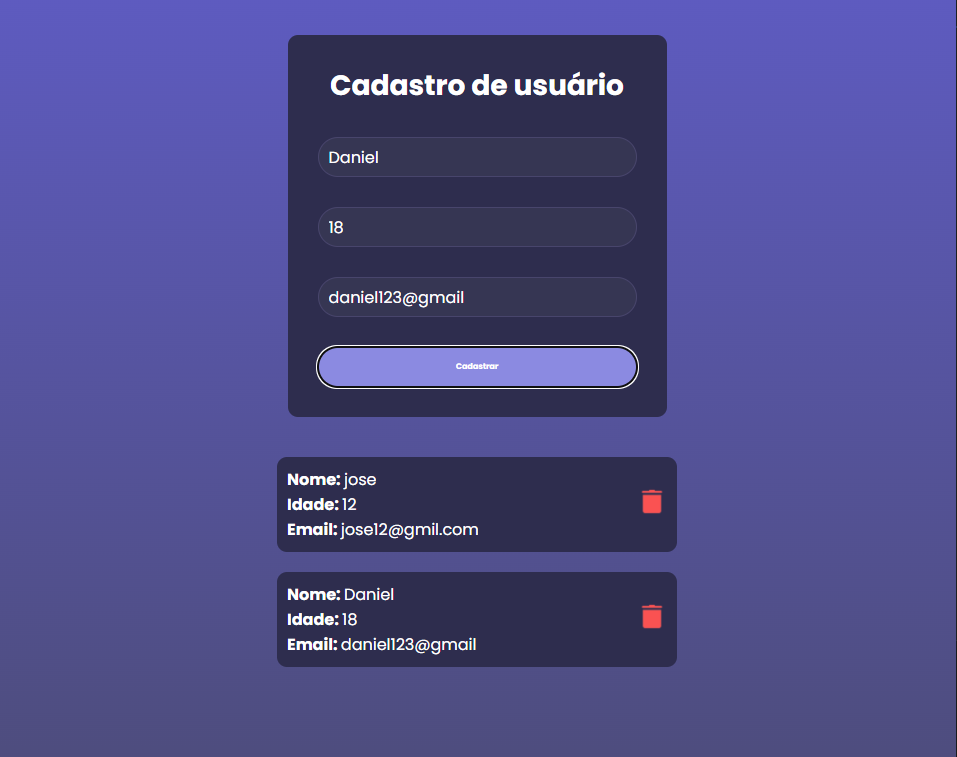

# Cadastro de Usuários Full-Stack (React, Node.js, Express, Prisma & MongoDB)

Este é um projeto full-stack de uma aplicação de "Cadastro de Usuários". O projeto é composto por uma API back-end construída com Node.js, Express e Prisma (conectado ao MongoDB) e um front-end interativo construído com React e Vite.

## Visão Geral do Projeto

O objetivo desta aplicação é permitir o cadastro, a visualização e a exclusão de usuários. O front-end (React) consome a API (Node/Express) para realizar as operações CRUD (Criar, Ler, Excluir).



## Funcionalidades

* **Criar Usuário:** Formulário para inserir nome, idade e email.
* **Listar Usuários:** Exibe todos os usuários cadastrados em cards.
* **Excluir Usuário:** Botão de exclusão (ícone de lixeira) em cada card de usuário.

## Tecnologias Utilizadas

O projeto é dividido em duas partes principais:

### 1. Back-end (`API`)

* **Node.js:** Ambiente de execução JavaScript no servidor.
* **Express:** Framework para criação da API RESTful.
* **Prisma:** ORM (Object-Relational Mapper) para interagir com o banco de dados.
* **MongoDB:** Banco de dados NoSQL utilizado para armazenar os dados.
* **`dotenv`:** Para gerenciamento de variáveis de ambiente.
* **`cors`:** Para permitir que o front-end acesse a API.

### 2. Front-end (`DL-CADASTRO-USUARIOS`)

* **React:** Biblioteca para construção da interface de usuário.
* **Vite:** Ferramenta de build e servidor de desenvolvimento rápido.
* **Axios** (ou `fetch`): Para realizar as requisições HTTP para a API.
* **CSS:** Para estilização dos componentes.

## Estrutura do Projeto

O repositório está organizado em uma estrutura de "monorepo" (dois projetos em um mesmo repositório):

```text
/ React+Node
├── API/              (Projeto Back-end)
│   ├── prisma/       (Schema e migrações do Prisma)
│   ├── .env          (Variáveis de ambiente, ex: DATABASE_URL)
│   ├── server.js     (Arquivo principal do servidor Express)
│   └── package.json
│
└── DL-CADASTRO-USUARIOS/ (Projeto Front-end)
    ├── public/
    ├── src/
    │   ├── assets/       (Imagens, como trash.png)
    │   ├── pages/
    │   │   └── Home/
    │   │       ├── index.jsx (Componente da página principal)
    │   │       └── style.css (Estilos da página Home)
    │   ├── services/
    │   │   └── api.js      (Configuração do Axios/API)
    │   ├── main.jsx        (Ponto de entrada do React)
    │   └── index.css       (Estilos globais)
    ├── index.html      (Arquivo HTML principal)
    ├── vite.config.js
    └── package.json
             


## Autor

**Daniel Luiz (Dois L)**

* [LinkedIn](https://www.linkedin.com/in/daniel-luiz1607/)
* [GitHub](https://github.com/danielluiz07)